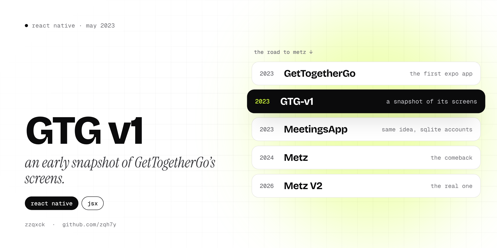

  

  
  

# GTG v1

GTG stands for **GetTogetherGo**, my first Expo app and the very beginning of what's now [Metz](https://github.com/zqh7y/MetzV2). This repo is a snapshot of its screens from **May 2023**, saved as a single commit.

It's only the React Native screen files, without `package.json`, images or fonts, so it doesn't run by itself. It's here as a record of where the project was early on. For the full, runnable version of this generation (with screenshots), see **[GetTogetherGo](https://github.com/zqh7y/GetTogetherGo)**.

## What's in the snapshot

| File | Screen |
|---|---|
| `js/Welcome.jsx` | Welcome: start as a guest or log in |
| `js/Log/` | Log in and sign up |
| `js/Main.jsx` | Home, with links to the map, chat and posts |
| `js/Meeting/Map.jsx` | The meetings map (`react-native-maps`) |
| `js/Meeting/Create.jsx`, `js/CreateAny.jsx` | Creating a meeting |
| `js/Meeting/Notes.jsx` | Notes for your meetings |
| `js/Social/Chat.jsx` | Chat, recommended groups and people to meet |
| `js/Social/GroupCreate.jsx` | Creating a group |
| `js/Social/Profile.jsx` | Your profile, with a photo from the gallery |
| `js/Scroll.jsx` | The posts feed |

Built with React Native and Expo, using `react-native-maps`, `react-native-image-picker`, `@react-native-picker/picker`, AsyncStorage and `@expo/vector-icons`.

## The road to Metz

| Year | Version |
|---|---|
| 2023 | [GetTogetherGo](https://github.com/zqh7y/GetTogetherGo), the first Expo app |
| 2023 | **GTG v1**, this snapshot |
| 2023 | [MeetingsApp](https://github.com/zqh7y/MeetingsApp), same idea with SQLite accounts |
| 2024 | [Metz](https://github.com/zqh7y/Metz), the comeback |
| 2026 | [Metz V2](https://github.com/zqh7y/MetzV2), the real one |

---

  Made by <b>zzqxck</b> · <a href="https://zqh7y.github.io/Portfolio/">portfolio</a> · <a href="https://github.com/zqh7y">more projects</a>

